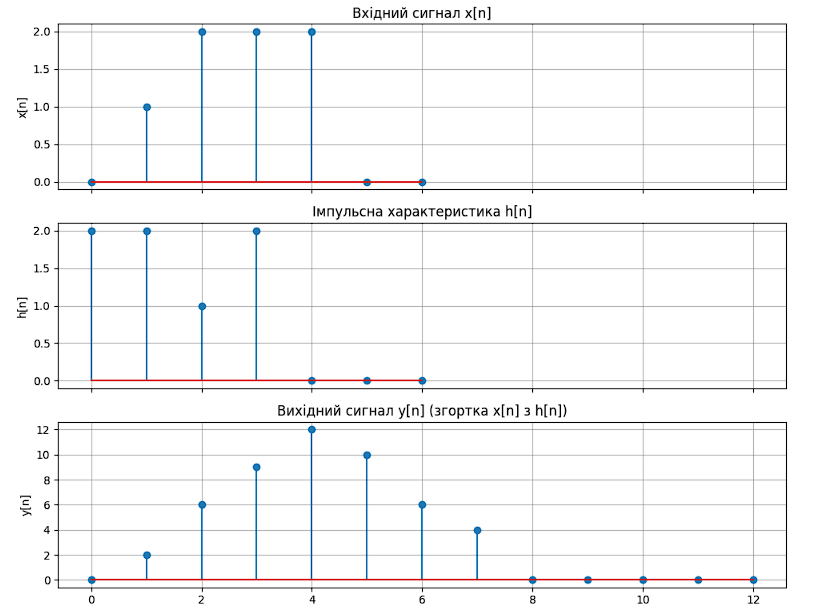

### Задача 1.1 (Сигнали)

Нехай f[k] = 0 для k < 0 та f[k] = aᵏ для k ≥ 0. Для яких значень a ∈ ℂ сигнал f[·]:

а) правосторонній?

б) лівосторонній?

в) абсолютно сумовний?

г) квадратично сумовний?

д) обмежений?

Давайте розв'яжемо це поетапно:

 Спочатку визначимо послідовність f[k]:
   - Для k < 0: f[k] = 0
   - Для k ≥ 0: f[k] = aᵏ

 а) Правосторонній:
   Сигнал правосторонній, якщо він нульовий для всіх k < N, де N - деяке ціле число.
   В нашому випадку f[k] = 0 для всіх k < 0, тому сигнал правосторонній для всіх a ∈ ℂ.
   Тобто, це правостороння послідовність за визначенням, оскільки існує таке k₀ (в нашому випадку k₀ = 0), що f[k] = 0 для всі k < k₀.

 б) Лівосторонній:
   Сигнал лівосторонній, якщо він нульовий для всіх k > N, де N - деяке ціле число.
   Для k ≥ 0: f[k] = aᵏ
   Щоб сигнал був лівостороннім, потрібно |a| = 0, тобто a = 0.
   Ні, це не лівостороння послідовність, оскільки вона не стає нульовою для всіх k більше деякого k₀.


в) Абсолютно сумовний:
   Сигнал абсолютно сумовний, якщо ∑|f[k]| < ∞
   ∑|f[k]| = ∑|aᵏ| = ∑|a|ᵏ для k ≥ 0
   Це геометричний ряд, який збігається тоді і тільки тоді, коли |a| < 1

 г) Квадратично сумовний:
   Сигнал квадратично сумовний, якщо ∑|f[k]|² < ∞
   ∑|f[k]|² = ∑|aᵏ|² = ∑|a|²ᵏ для k ≥ 0
   Це геометричний ряд, який збігається тоді і тільки тоді, коли |a|² < 1
   Тобто |a| < 1

 д) Обмежений:
   Сигнал обмежений, якщо існує M > 0 таке, що |f[k]| ≤ M для всіх k
   Для k < 0: |f[k]| = 0 ≤ M
   Для k ≥ 0: |f[k]| = |a|ᵏ
   Сигнал буде обмеженим тоді і тільки тоді, коли |a| ≤ 1

Відповідь:
а) Для всіх a ∈ ℂ
б) Тільки для a = 0
в) Для |a| < 1
г) Для |a| < 1
д) Для |a| ≤ 1


### Задача 1.2 (Операції з одиничним ступінчастим сигналом)
З даного дискретного сигналу f[·] ми можемо отримати нові дискретні сигнали за допомогою операцій, таких як зсув у часі або обернення часу. Нехай σ[·] буде одиничним ступінчастим сигналом

σ[k] = {
  1, k ≥ 0,
  0, k < 0.

а) Зобразіть графічно наступні сигнали:
   i) σ[·- 2]
   ii) σ[·+ 2]
   iii) σᵗ[·]
   iv) σᵗ[·- 2] = σ[-·+ 2]
   v) σᵗ[·+ 2] = σ[-·- 2]

б) Які з сигналів в пункті а) є правосторонніми? лівосторонніми? каузальними?

Давайте розберемо це поетапно:

1) Спочатку зрозуміємо, що означає кожна операція:
- σ[k - 2] - зсув вправо на 2 позиції
- σ[k + 2] - зсув вліво на 2 позиції
- σᵗ[k] - обернення часу
- σᵗ[k - 2] = σ[-k + 2] - обернення часу та зсув вправо
- σᵗ[k + 2] = σ[-k - 2] - обернення часу та зсув вліво

2) Характеристики сигналів:
i) σ[k - 2]: 
   - Стає 1 при k ≥ 2
   - Правосторонній
   - Каузальний

ii) σ[k + 2]:
   - Стає 1 при k ≥ -2
   - Правосторонній
   - Не каузальний

iii) σᵗ[k]:
    - Стає 0 при k > 0
    - Лівосторонній
    - Не каузальний

iv) σᵗ[k - 2] = σ[-k + 2]:
    - Стає 0 при k > 2
    - Лівосторонній
    - Не каузальний

v) σᵗ[k + 2] = σ[-k - 2]:
   - Стає 0 при k > -2
   - Лівосторонній
   - Не каузальний

Відповідь на пункт б):
- Правосторонні: i), ii)
- Лівосторонні: iii), iv), v)
- Каузальні: тільки i)


### Задача 1.3 (Згортка)
Вхідний сигнал x[·] та імпульсна характеристика h[·] ЛІС-системи (Лінійної Інваріантної в часі Системи) задані наступним чином:

[На графіках показано:]
x[n]:
- при n = 0: x[0] = 0
- при n = 1: x[1] = 1
- при n = 2: x[2] = 2
- при n = 3: x[3] = 0
- при n = 4: x[4] = 2
- при n = 5: x[5] = 2
- при n = 6: x[6] = 0

h[n]:
- при n = 0: h[0] = 2
- при n = 1: h[1] = 2
- при n = 2: h[2] = 1
- при n = 3: h[3] = 0
- при n = 4: h[4] = 2
- при n ≥ 5: h[n] = 0

Визначте результуючий вихідний сигнал y[·] ЛІС-системи:

а) за допомогою формального z-перетворення.

б) за допомогою графічного обчислення згортки x[·] з h[·].

Для розв'язання цієї задачі потрібно:
1) Для пункту а):
   - Знайти Z-перетворення x[n] -> X(z)
   - Знайти Z-перетворення h[n] -> H(z)
   - Перемножити X(z)H(z) = Y(z)
   - Знайти зворотне Z-перетворення Y(z) -> y[n]


2) Для пункту б):
   - Використати формулу згортки: y[n] = Σ x[k]h[n-k]
   - Графічно обчислити згортку для кожного значення n
   - Побудувати результуючий сигнал y[n]


Розв'яжемо цю задачу двома підходами, як описано в умовах:

### Розв’язання:
1. **Z-перетворення (пункт а)**:
   - Знайдемо Z-перетворення для \( x[n] \) і \( h[n] \).
   - Перемножимо отримані вирази для \( X(z) \) і \( H(z) \), щоб отримати \( Y(z) \).
   - Знайдемо зворотне Z-перетворення \( Y(z) \), щоб отримати \( y[n] \).

2. **Згортка (пункт б)**:
   - Скористаємося формулою згортки \( y[n] = \sum_{k=0}^{n} x[k] \cdot h[n - k] \) для дискретного сигналу.
   - Обчислимо кожне значення \( y[n] \) для \( n \) у діапазоні, що покриває довжину сигналу.

Зробимо візуалізацію вхідного сигналу \( x[n] \), імпульсної характеристики \( h[n] \) та результуючого сигналу \( y[n] \), отриманого шляхом згортки. Це допоможе краще зрозуміти, як формується вихідний сигнал.

Для цього напишемо Python код, щоб обчислити вихідний сигнал \( y[n] \) для обох підходів.

Код для побудови всіх трьох графіків:

```python
import numpy as np
from scipy.signal import convolve
import matplotlib.pyplot as plt

# Вхідні дані
x = [0, 1, 2, 0, 2, 2, 0]
h = [2, 2, 1, 0, 2, 0]

# Згортка для обчислення y[n]
y = convolve(x, h)

# Побудова графіків
fig, axs = plt.subplots(3, 1, figsize=(10, 8), sharex=True)

# Графік для x[n]
n_x = np.arange(len(x))
axs[0].stem(n_x, x, use_line_collection=True)
axs[0].set_title("Вхідний сигнал x[n]")
axs[0].set_ylabel("x[n]")
axs[0].grid(True)

# Графік для h[n]
n_h = np.arange(len(h))
axs[1].stem(n_h, h, use_line_collection=True)
axs[1].set_title("Імпульсна характеристика h[n]")
axs[1].set_ylabel("h[n]")
axs[1].grid(True)

# Графік для y[n]
n_y = np.arange(len(y))
axs[2].stem(n_y, y, use_line_collection=True)
axs[2].set_title("Вихідний сигнал y[n] (згортка x[n] з h[n])")
axs[2].set_xlabel("n")
axs[2].set_ylabel("y[n]")
axs[2].grid(True)

plt.tight_layout()
plt.show()
```

### Пояснення коду:

1. **Z-перетворення (а)**: 
   - Хоча Z-перетворення формально визначає множення в частотній області, у випадку дискретних сигналів, результат вихідного сигналу \( y[n] \) після зворотного перетворення можна отримати як згортку сигналів \( x[n] \) і \( h[n] \).

2. **Згортка (б)**:
   - Використовується функція `convolve` для обчислення згортки \( x[n] \) та \( h[n] \).
   - Результат виводиться на екран і відображається на графіку.

Цей код дає значення вихідного сигналу \( y[n] \) та будує графік для наочного зображення результату.


- **x[n]** — відображає вхідний сигнал, як задано у задачі.
- **h[n]** — відображає імпульсну характеристику.
- **y[n]** — результуючий сигнал після згортки.

Кожен сигнал представлено окремим графіком для зручного порівняння та аналізу, де осі позначені відповідно до значення \( n \) та амплітуд сигналів.

   


### Задача 1.4 (Згортка)

Нехай σ[·] буде одиничним ступінчастим сигналом (як у Задачі 1.2).

а) Обчисліть згортку (σ * σ)[·] сигналу σ[·] із самим собою.

б) Обчисліть згортку (σ * σᵗ)[·].

в) Доведіть, що згортка:

i) двох правосторонніх сигналів 
ii) двох лівосторонніх сигналів
iii) сигналу з скінченною тривалістю (тобто, правостороннього та лівостороннього) із довільним сигналом

завжди є коректно визначеною.

Давайте розв'яжемо це поетапно:

1) а) Згортка (σ * σ)[k]:
   - Для k < 0: (σ * σ)[k] = 0, оскільки σ[n] = 0 при n < 0
   - Для k ≥ 0: (σ * σ)[k] = Σ σ[n]σ[k-n] = Σ 1·1 = k+1

2) б) Згортка (σ * σᵗ)[k]:
   - Для k < 0: (σ * σᵗ)[k] = Σ σ[n]σᵗ[k-n] = 0, оскільки σᵗ[n] = 0 при n > 0
   - Для k ≥ 0: (σ * σᵗ)[k] = Σ σ[n]σᵗ[k-n] = Σ 1·1 = k+1

3) в) Доведення:

i) Два правосторонні сигнали:
   Нехай x[k] та h[k] - правосторонні сигнали.
   Тоді (x*h)[k] = Σ x[n]h[k-n] = 0 для k < 0, оскільки x[n] = 0 та h[k-n] = 0 при n,k-n < 0.
   Отже, (x*h)[k] є коректно визначеною.

ii) Два лівосторонні сигнали: 
   Аналогічно, якщо x[k] та h[k] - лівосторонні сигнали, то (x*h)[k] = 0 для k > 0.
   Тому (x*h)[k] є коректно визначеною.

iii) Сигнал з скінченною тривалістю та довільний сигнал:
    Нехай x[k] - сигнал з скінченною тривалістю, а h[k] - довільний сигнал.
    Тоді (x*h)[k] = Σ x[n]h[k-n] є коректно визначеним, оскільки сума має скінченну кількість ненульових доданків.

Отже, в усіх трьох випадках згортка є коректно визначеною.


